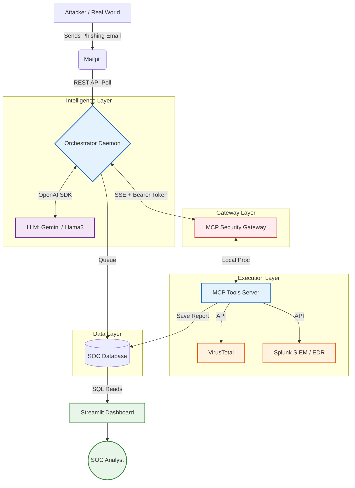
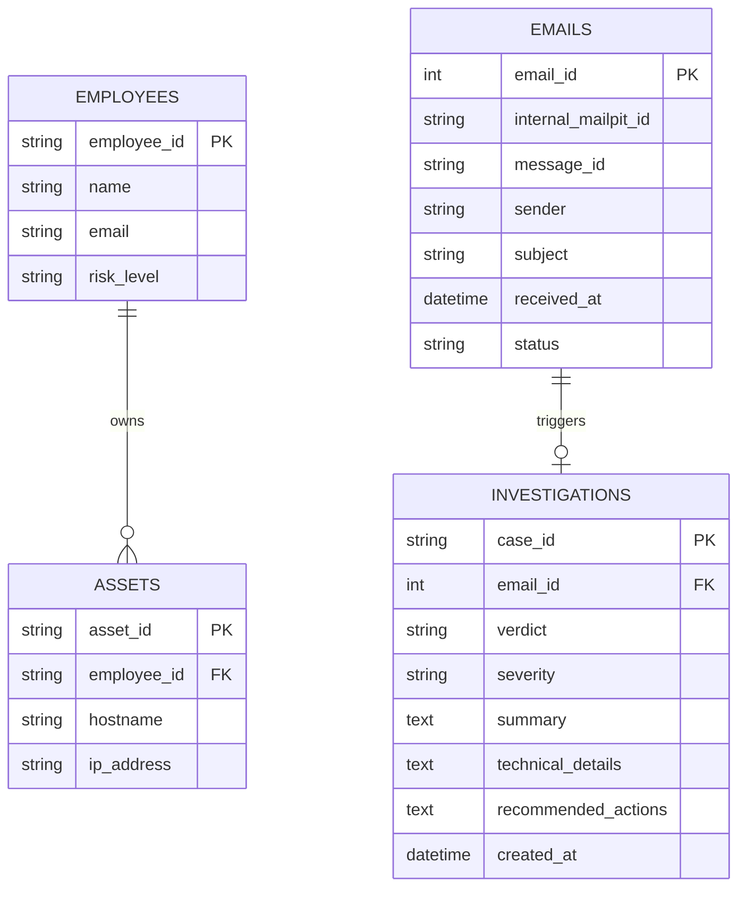
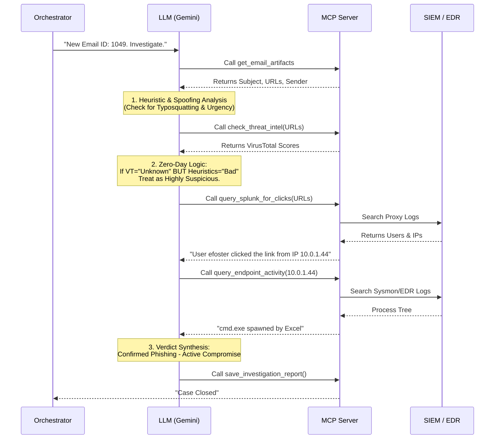

# Enterprise Autonomous Phishing Triage Platform
## Complete Architecture & Project Documentation

---

## 1. Executive Summary
The **Enterprise Autonomous Phishing Triage Platform** is an AI-driven security tool designed to fully automate the detection, investigation, and reporting of phishing emails. By combining Large Language Models (LLMs) with the Model Context Protocol (MCP), the platform operates exactly like a Level 3 SOC Analyst—hunting for zero-day threats, analyzing heuristic data, correlating internal SIEM/EDR logs, and generating human-readable case reports with zero manual intervention.

---

## 2. What is MCP and Why Use It?
**Model Context Protocol (MCP)** is a standardized protocol that allows AI models to securely connect to external tools, databases, and APIs. 

**Why we use it:**
Traditionally, an LLM is a "brain in a jar"—it can think, but it cannot act. By using an MCP Client-Server architecture:
*   **The Brain (Client):** The LLM runs in the Orchestrator, deciding *what* to investigate.
*   **The Hands (Server):** The `phishing_mcp.py` script securely holds the keys to Splunk, VirusTotal, and the Database. 
*   **Security:** The LLM never sees the API keys or the raw database structure. It simply asks the MCP server to "Run a Splunk query," and the MCP server executes the code locally and returns the text result. This creates a secure sandbox preventing AI hallucinations from executing destructive commands.

---

## 3. The "Why": Strategic Reasoning Behind This Approach
This architecture was specifically designed to solve the critical flaws found in traditional SOC environments and basic AI Proof-of-Concepts:

1. **Eliminating the Human Bottleneck (Alert Fatigue):** 
   A manual AI tool (like a chatbot) still requires a human analyst to copy/paste logs. By introducing the **Autonomous Orchestrator Daemon**, we shifted the AI to the very front of the pipeline. It handles the initial 80% of the workload (data gathering and correlation) *before* a human is ever alerted, dramatically reducing alert fatigue.
2. **Defeating the "Zero-Day" Reality:** 
   Traditional tools rely on "Known Bad" signatures (Threat Intel). However, attackers register fresh domains minutes before an attack. We engineered the LLM Prompt to perform **Heuristic Analysis** (checking for typosquatting, urgency, and brand mismatch). If Threat Intel fails, the AI trusts its heuristics to identify a zero-day and immediately checks the SIEM for a blast radius.
3. **Strict Sandboxing via MCP:** 
   Giving an AI direct access to a corporate SIEM or EDR is a massive security risk. The Model Context Protocol (MCP) acts as a strict boundary. The AI can only "request" a specific query; the Python MCP Server validates and executes it. The AI cannot accidentally delete databases or execute malicious payloads.
4. **Relational Context vs. Flat Logs:** 
   Phishing is not just about the email; it's about *who* received it and *what machine* they were on. By moving to a **Normalized Relational Database**, the architecture maps Emails ↔ Employees ↔ Assets. This enables the next phase of the project: tracking longitudinal risk and detecting widespread campaigns across the enterprise.

---

## 4. System Architecture
The platform is built on a highly modular, event-driven pipeline. 

### Component Breakdown
1. **Ingestion Layer (Mailpit):** Captures raw SMTP traffic and exposes it via REST API. Simulates an enterprise Exchange/Google Workspace server.
2. **Autonomous Orchestrator (`custom_mcp_client.py`):** A persistent Python daemon. It polls Mailpit every 10 seconds for new emails, registers them in the database queue, and spins up a **Multi-Agent Swarm** to investigate them in parallel.
3. **Security Gateway (`mcp_gateway.py`):** A Starlette-based API server bridging the Orchestrator and tools via Server-Sent Events (SSE). It enforces Role-Based Access Control (RBAC), audits all actions, and filters malicious inputs.
4. **Execution Server (`phishing_mcp.py`):** The isolated Python tools containing the specific logic (`get_email_artifacts`, `check_threat_intel`, `query_splunk`). 
5. **Memory Layer (`soc_db.sqlite`):** A normalized relational SQLite database tracking the lifecycle of Emails, Investigations, Employees, and Corporate Assets.
6. **Presentation Layer (`app.py`):** A real-time Streamlit dashboard providing human SOC analysts with a read-only, high-level view of automated investigations.

---

## 5. Database Architecture (The Memory Layer)
To enable advanced correlation and future proactive hunting (e.g., detecting multi-user phishing campaigns), the system relies on a normalized relational SQLite database (`soc_db.sqlite`). This is a significant upgrade from the original PoC's flat text file.

- **Emails & Investigations:** A one-to-one relationship ensuring every ingested email is tracked from `Pending` to `Investigated`, with its resulting verdict stored safely.
- **Employees & Assets:** Allows the system to map a malicious click from a specific `ip_address` back to the human `employee_id` and evaluate their historical `risk_level`.

---

## 6. The Autonomous Investigation Workflow
When a new email hits the queue, the LLM strictly follows this Chain-of-Thought workflow to prevent false positives and catch zero-days.

---

## 7. Changelog & Project Evolution
This section tracks the architectural improvements made to the platform as it evolves from a Proof-of-Concept to an Enterprise-Ready solution.

### Phase 1: PoC to Enterprise Pipeline Migration
* **Manual to Autonomous Orchestration:** Replaced the Claude Desktop App (which required manual human prompting) with a custom Python daemon (`custom_mcp_client.py`) that handles queue management and LLM context building autonomously.
* **O(1) Data Retrieval:** Replaced an inefficient, fuzzy-matching search tool with a direct `$O(1)` ID-based database lookup.
* **Relational Normalization:** Migrated from a flat, monolithic text file (`cases.db`) to a normalized, relational schema (`soc_db.sqlite`) mapping `Emails` ↔ `Investigations`. 
* **Zero-Day Prompt Logic:** Upgraded the LLM System Prompt. The AI is no longer reliant purely on VirusTotal. It now actively analyzes heuristics (typosquatting, urgency) to detect Zero-Days that bypass Threat Intel.
* **False Positive Prevention:** Added explicit logic to the LLM to identify internal, benign emails (like Helpdesk updates), forcing a `SAFE` verdict rather than triggering alerts.
* **Human-Readable Case Context:** Removed random UUID case IDs. Case IDs are now intelligently constructed using the actual Message-ID and timestamp (e.g., `CAS-MSG-1049-20260419-140326`).
* **Model Agnosticism:** Implemented the standard OpenAI Python SDK, allowing the Orchestrator to swap between Google Gemini, local Ollama (Llama 3), or any other compatible model with a single variable change.

### Phase 2: Multi-Agent Swarm & Fault Tolerance
* **High-Concurrency Swarm Architecture:** The Orchestrator now uses Python's `asyncio.gather` to pull up to 3 emails from the database simultaneously. It launches isolated instances of the Agent and MCP server in parallel, significantly improving throughput.
* **State Locking (Race Condition Prevention):** When the Orchestrator picks up emails, it instantly updates their database status to `Processing`. This guarantees two agents never accidentally investigate the same email.
* **Agent Isolation & Identity Logging:** Each agent in the swarm is given a distinct identity (e.g., `[Agent-1]`, `[Agent-2]`). Console logs are prefixed so SOC engineers can track exactly what each sub-agent is doing asynchronously.
* **Rate Limit Survival (Backoff Logic):** Because high-concurrency LLM swarms easily hit API quotas (e.g., Gemini's 15 RPM limit), a fault-tolerant `try/except` loop was implemented. If an agent hits a `429 Quota Exceeded` error, it automatically pauses, sleeps for 20 seconds, and gracefully resumes the investigation without crashing.

### Phase 3: Secure API Gateway, RBAC & Swarm Stability (Current)
* **Network Segregation (SSE Gateway):** Migrated from `stdio` (local subprocess) to a Starlette-based **Server-Sent Events (SSE)** architecture (`mcp_gateway.py`). The Orchestrator now connects to the tools over HTTP. This decouples the vulnerable LLM environment from the secure internal corporate network containing Splunk/EDR.
* **Role-Based Access Control (RBAC):** The Gateway acts as an Identity Provider using a Bearer token system. Agents connecting with an `L1_Triage` token are restricted to 2 passive tools (artifacts, threat intel), while `L3_Responder` tokens receive all 5 active tools.
* **Immutable Audit Logging:** Every tool call, connection, and security block is routed through Python's `logging` module to a persistent `audit.log` file. The Orchestrator cannot bypass this, creating a forensic, court-admissible trail of all AI actions.
* **OpSec Domain Filtering:** Implemented hardcoded interceptors in the Gateway. If an LLM attempts to send internal company domains (e.g., `yourcompany.com`) to external APIs like VirusTotal, the Gateway drops the request entirely and logs a `WARNING - BLOCKED` event.
* **Regex Input Validation:** To prevent Prompt/SPL Injection, tools like `query_endpoint_activity` now validate their arguments against strict regex patterns (e.g., enforcing valid IPv4 addresses) before passing them to the SIEM.
* **Jittered Staggered Execution:** To survive strict 429 Rate Limits while maintaining horizontal scalability, agents now start with a staggered delay (`AGENT_START_DELAY_SECONDS`), and rate-limit backoffs utilize randomized Jitter. This desynchronizes the swarm, preventing them from simultaneously slamming the LLM API when they wake up.
* **Crash Recovery & Stale State Mitigation:** If the Orchestrator daemon is abruptly killed, any emails left in the `Processing` state are automatically recovered back to `Pending` upon the next startup.
* **Enterprise Authentication Readiness:** The Token-based architecture was specifically built using standard HTTP Authorization headers, allowing an immediate, drop-in transition to Enterprise OAuth 2.0 (e.g., Auth0, Microsoft Entra ID) using PyJWT.

### Phase 4: Codebase Audit & Enterprise AI Capabilities
* **Centralized Configuration Management:** Refactored the architecture to use a single source of truth (`config.py`) for all paths, environment variables, and constants, eliminating hardcoded redundancy across the Gateway, Orchestrator, and Tools.
* **Architectural Cleanup & De-duplication:** Stripped out legacy dead code (e.g., unused FastMCP decorators, redundant database initializations) and transformed monolithic, stateless classes into pure Python functions, significantly improving maintainability and readability.
* **Agent Error Recovery (Anti-Orphaning):** Implemented robust timeout and exception handling within the Orchestrator's agent swarm. If an agent crashes or exceeds its timeout limit, the email is automatically reset from `Processing` to `Pending`, preventing orphaned investigations.
* **Confidence Calibration Engine:** Upgraded the AI decision engine to grade its own confidence on a 0.0 to 1.0 scale and output a JSON list of explicit "Uncertainty Factors" (e.g., missing logs, zero-day indicators). 
* **Automated Escalation Routing:** Based on the AI's confidence score, investigations are now dynamically routed: `Auto-Closed` (confidence > 0.85), `Flagged for Review` (0.60 to 0.85), or `Escalated to Human Analyst` (< 0.60).
* **Executive SOC Dashboard Upgrade:** Updated the Streamlit UI to visualize the Agent's Confidence via progress bars, introduced colored Escalation Badges (including pulsating alerts for human escalation), added an "Auto-Closed Rate" automation ROI metric, and surfaced the AI's blind spots directly to the human analyst to accelerate manual review.

---
